# User Interface

This page showcases the OTLP Cardinality Checker web interface.

## Dashboard

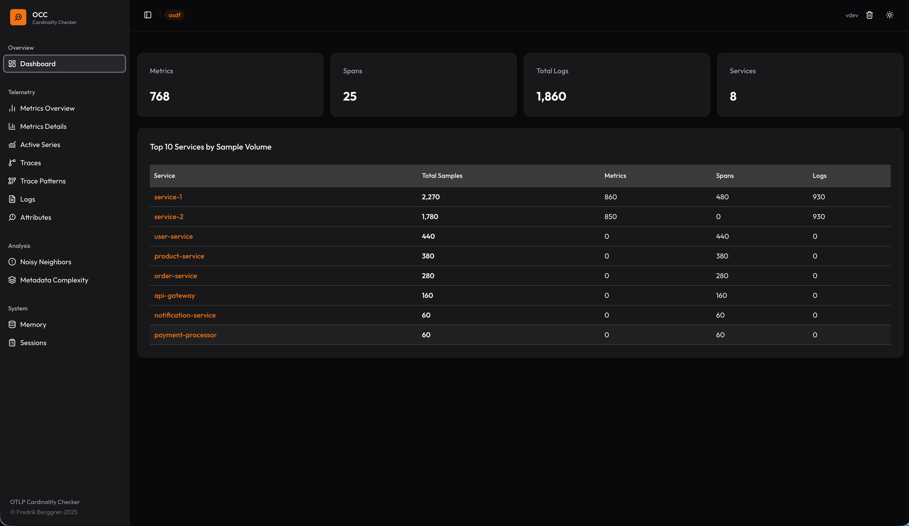

Main dashboard overview showing cardinality analysis across all signal types.

## Sessions Management

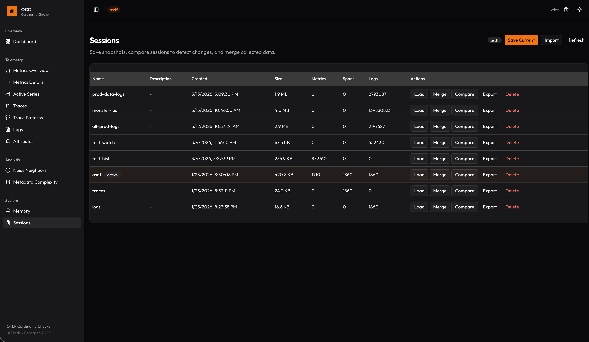

View and manage analysis sessions.

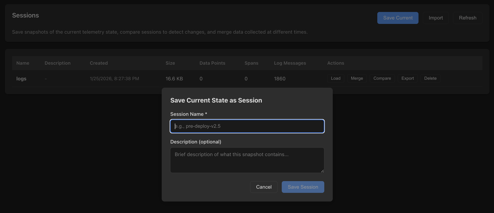

Save current analysis session for later review.

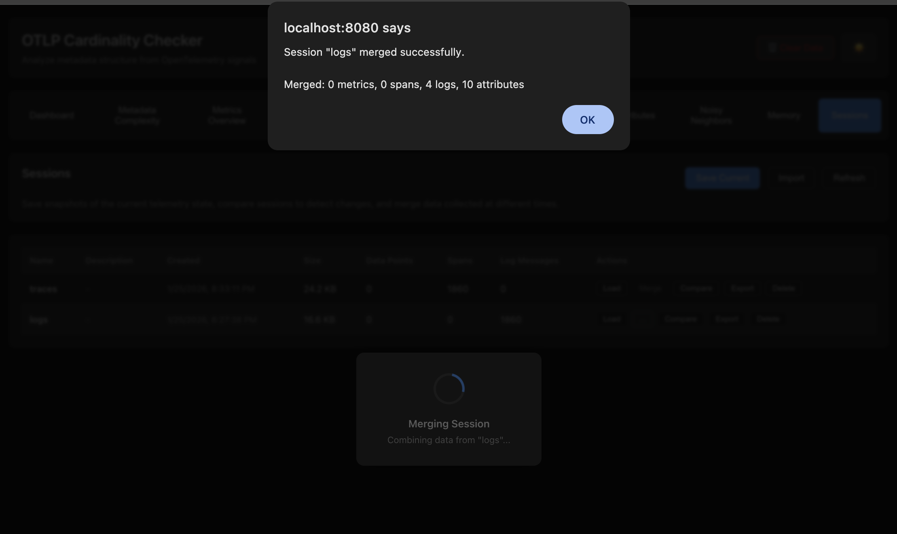

Merge multiple sessions to compare cardinality patterns over time.

## Metrics Analysis

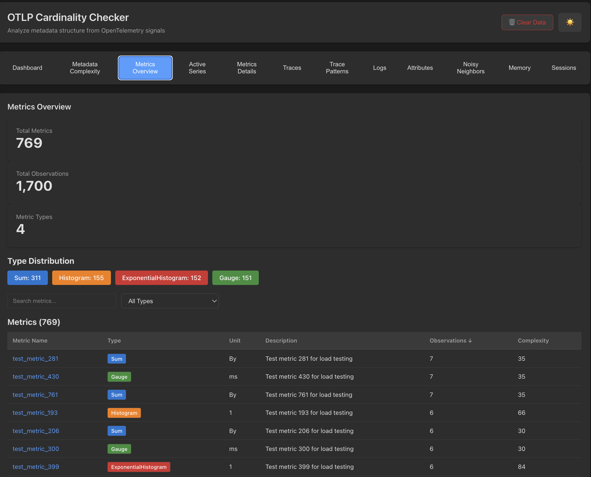

High-level overview of metrics cardinality patterns.

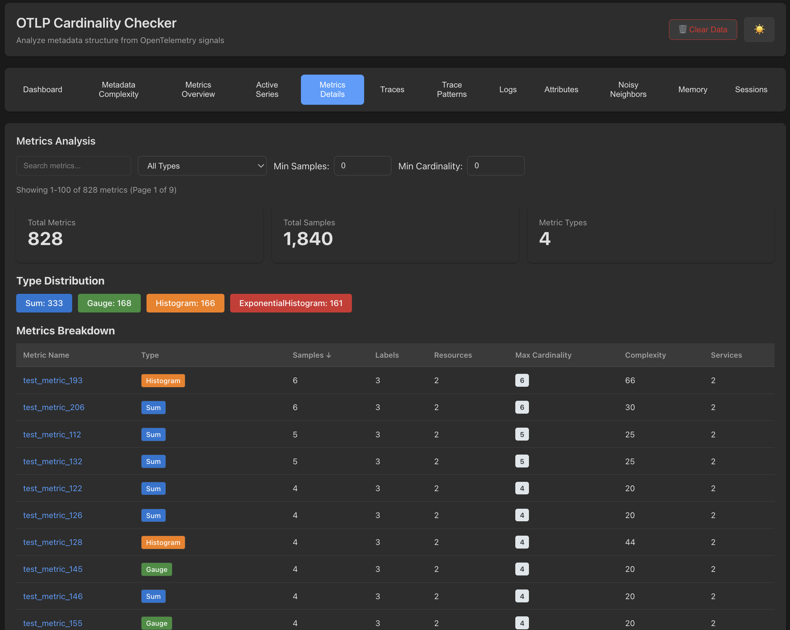

Detailed metrics cardinality analysis with breakdowns by attribute keys.

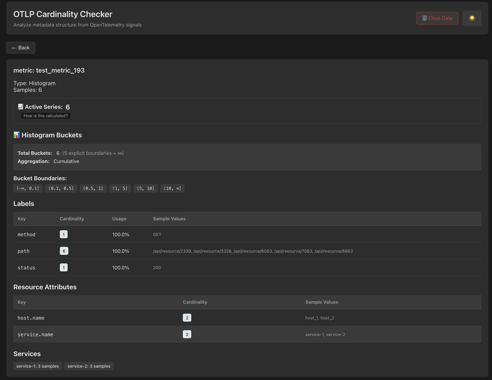

Deep dive into a specific metric's cardinality.

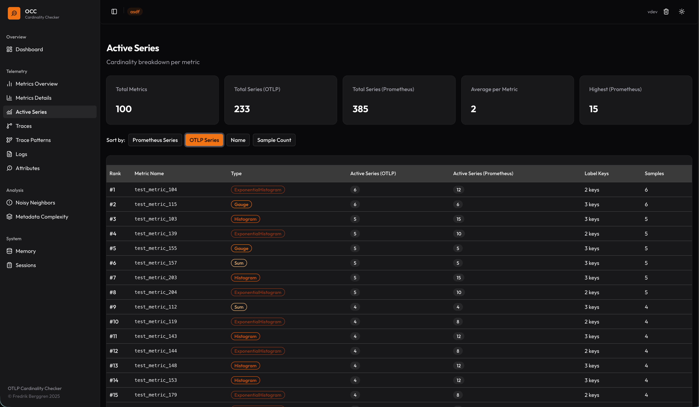

Active time series monitoring and cardinality tracking.

## Logs Analysis

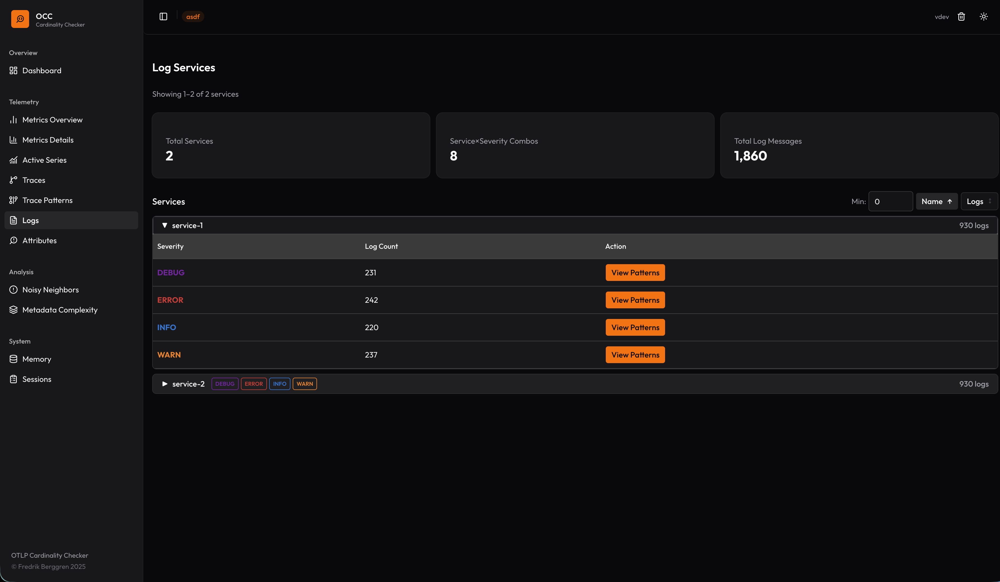

Log cardinality patterns and attribute key analysis.

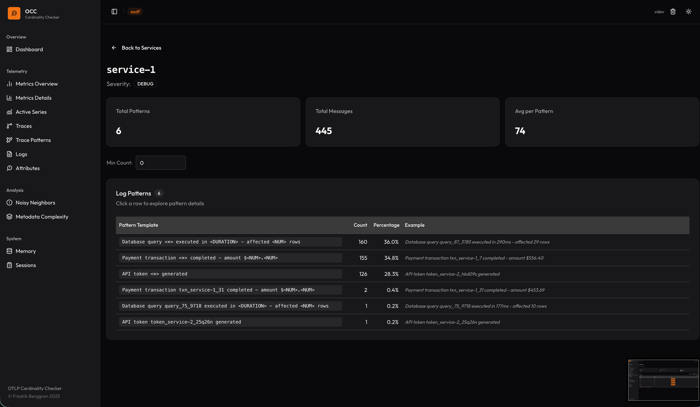

Detected patterns in log attribute cardinality.

## Traces Analysis

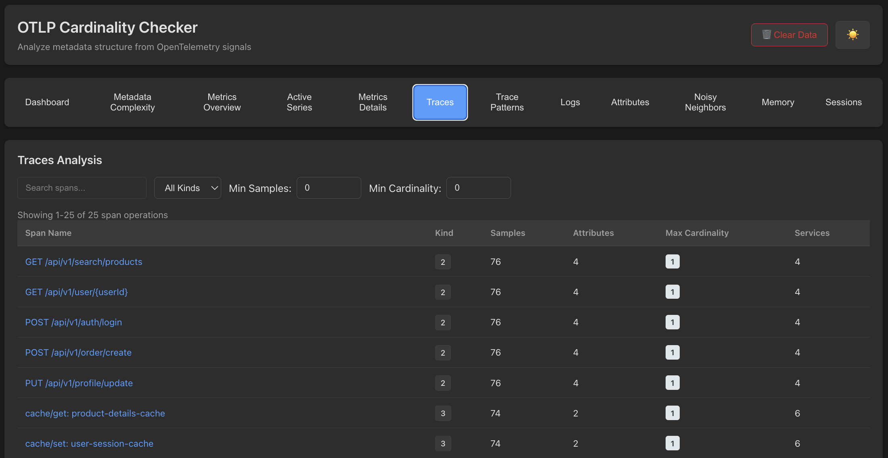

Trace cardinality overview and span attribute analysis.

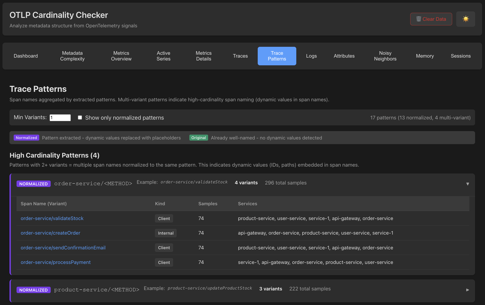

Pattern detection in trace attribute cardinality.

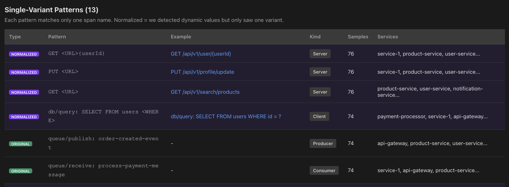

Additional trace pattern visualizations.

## Advanced Analysis

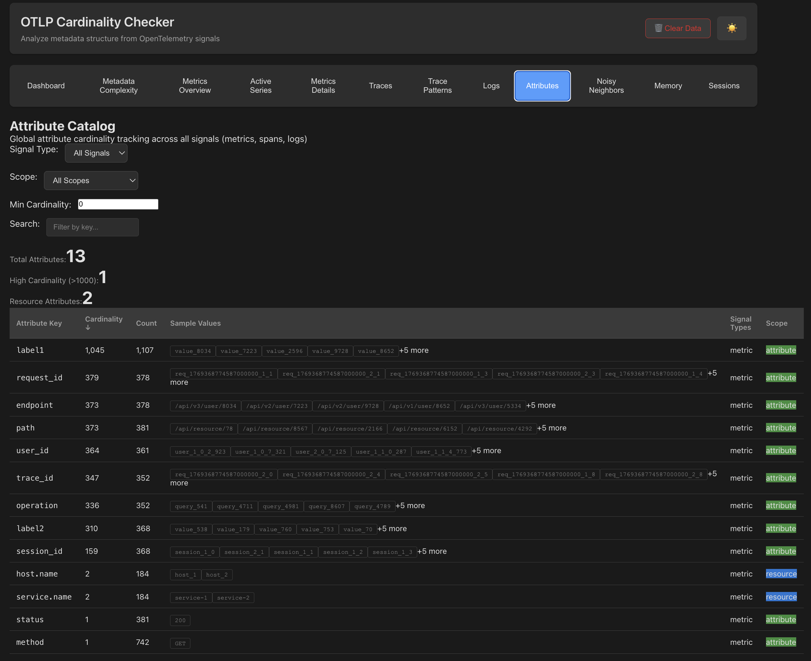

Cross-signal attribute key cardinality analysis.

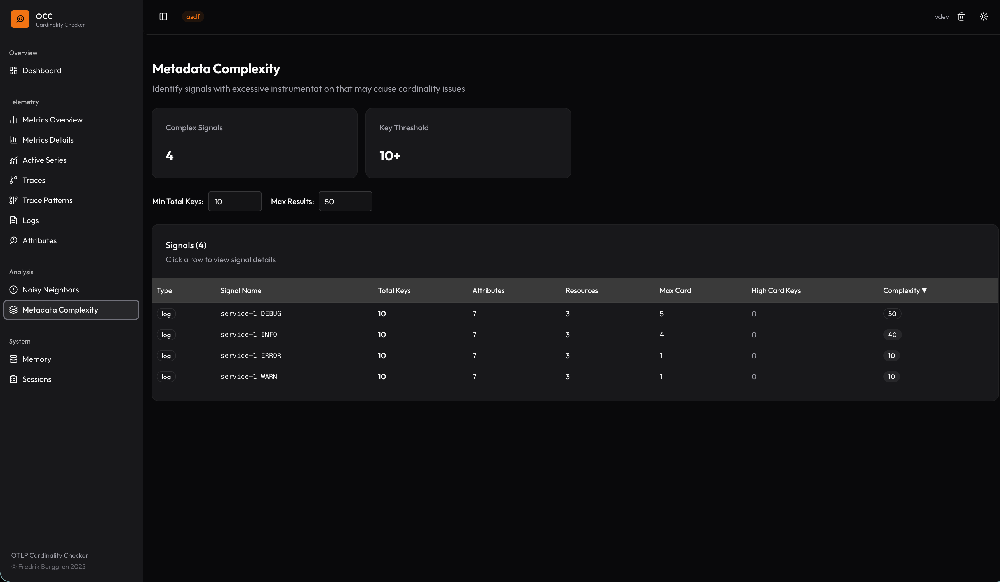

Metadata complexity visualization showing attribute key combinations.

## Load Testing

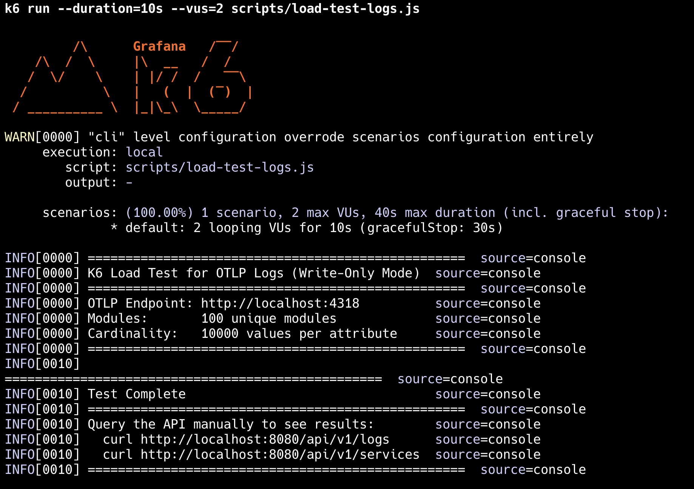

Cardinality behavior under load testing with k6.
