# User Interface

This page showcases the OTLP Cardinality Checker web interface.

## Dashboard

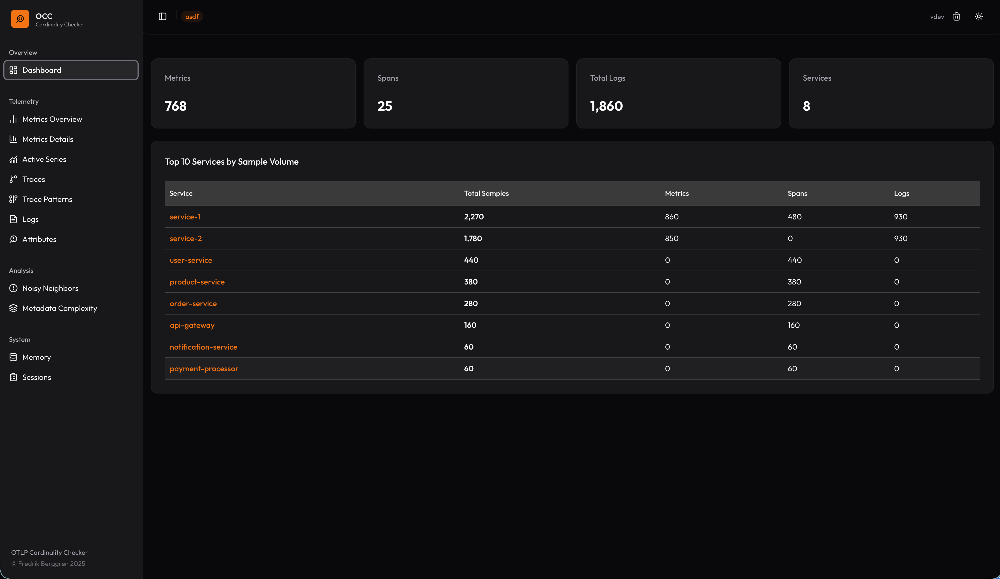

Main dashboard overview showing cardinality analysis across all signal types.

## Sessions Management

View and manage analysis sessions.

## Metrics Analysis

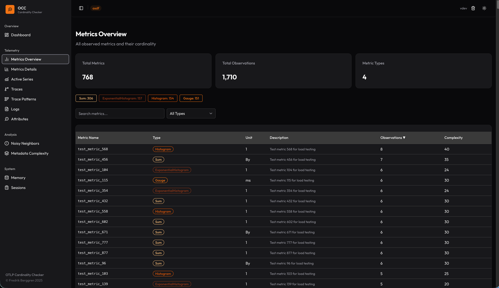

High-level overview of metrics cardinality patterns.

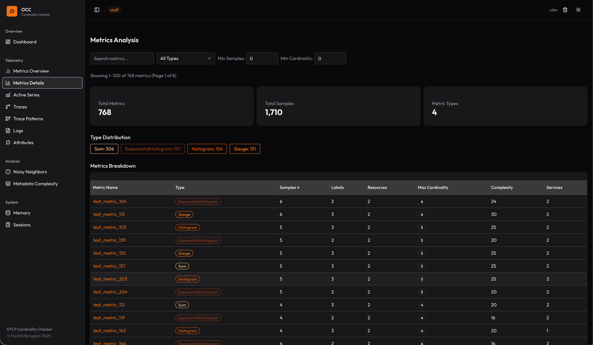

Detailed metrics cardinality analysis with breakdowns by attribute keys.

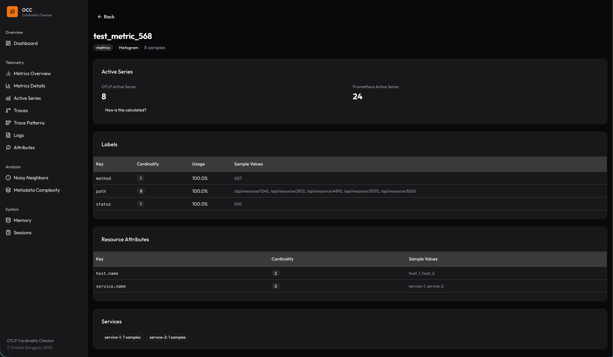

Deep dive into a specific metric's cardinality.

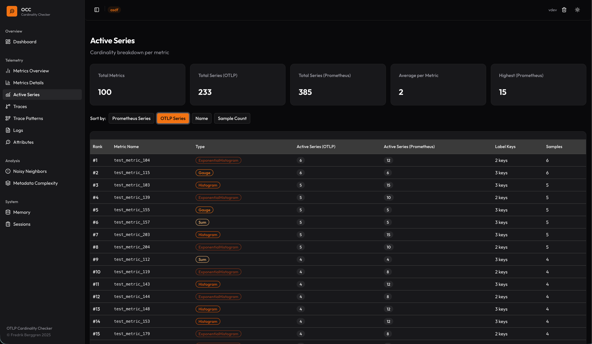

Active time series monitoring and cardinality tracking.

## Logs Analysis

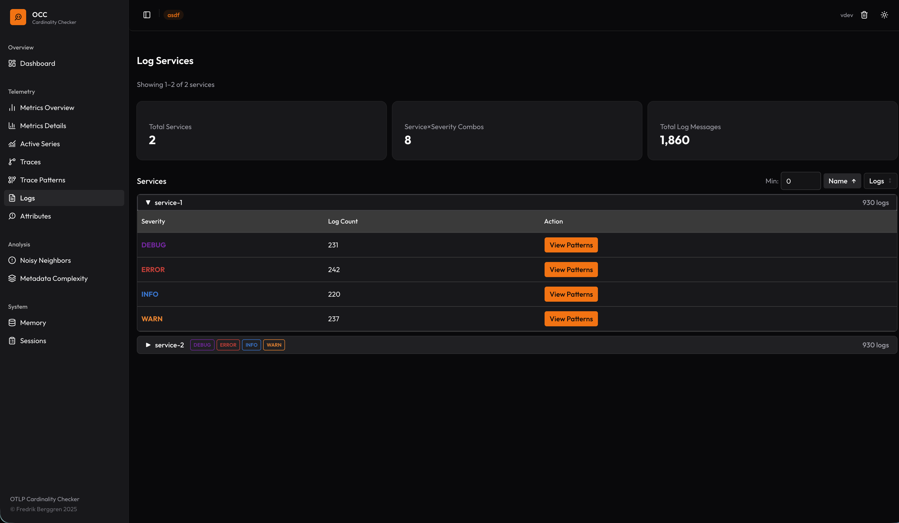

Log cardinality patterns and attribute key analysis.

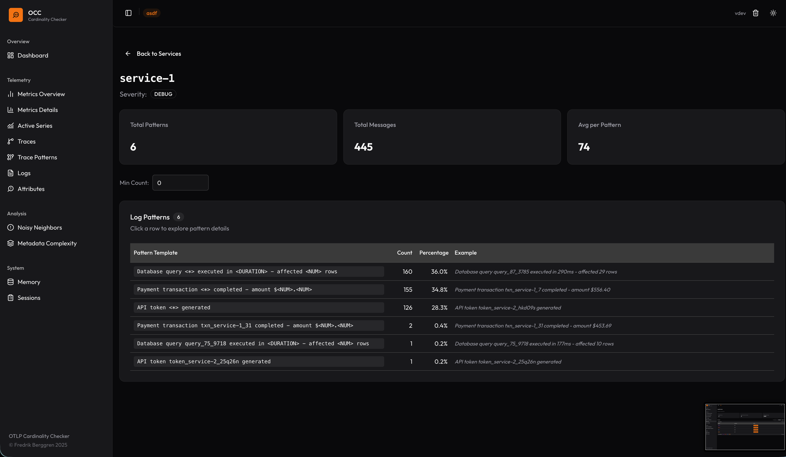

Detected patterns in log attribute cardinality.

## Traces Analysis

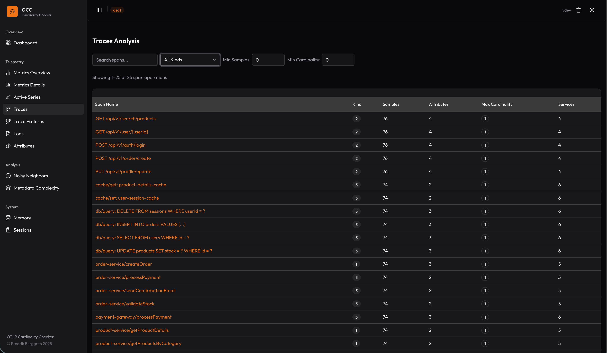

Trace cardinality overview and span attribute analysis.

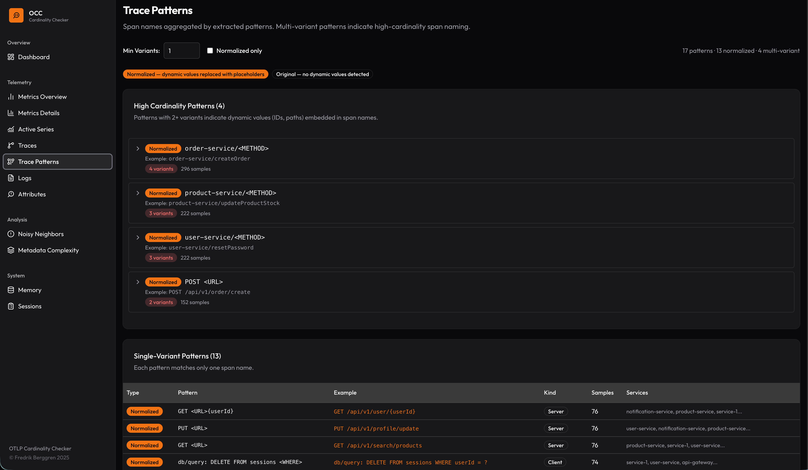

Pattern detection in trace attribute cardinality.

## Advanced Analysis

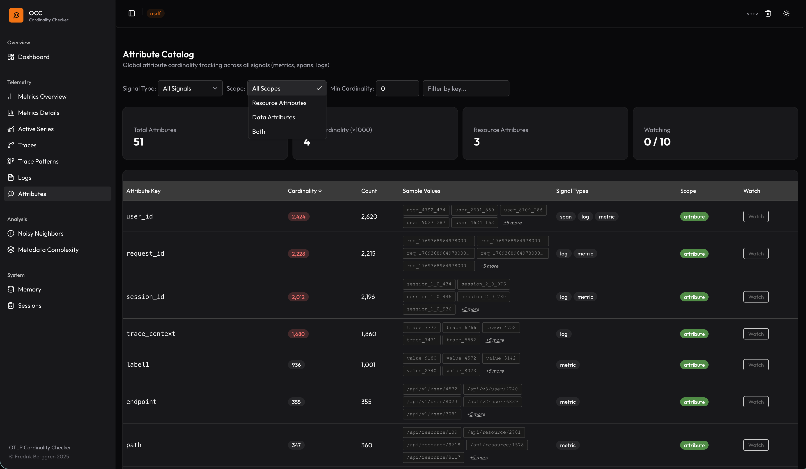

Cross-signal attribute key cardinality analysis.

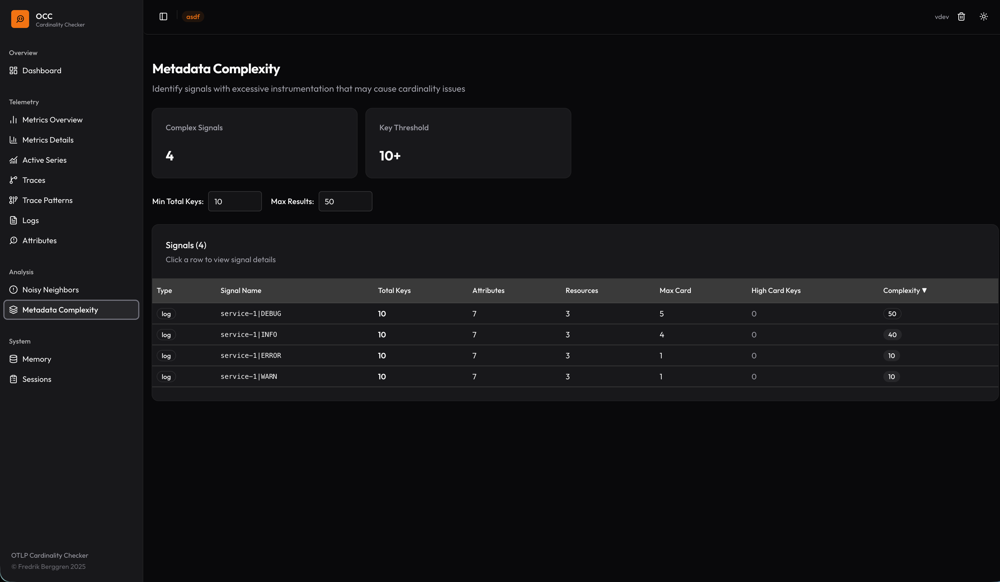

Metadata complexity visualization showing attribute key combinations.

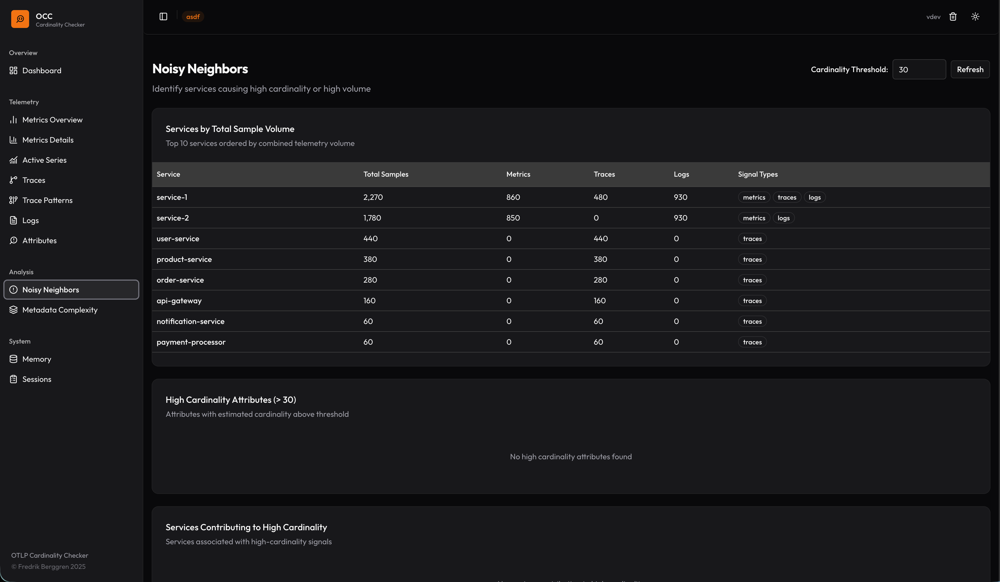

Shows problematic signals

## Memory

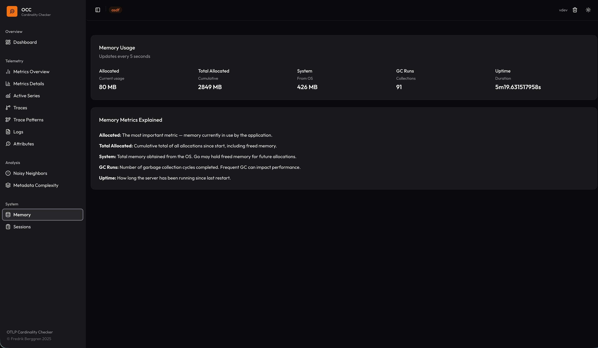

Runtime memory usage statistics — heap size, goroutine counts, and per-signal storage breakdown.

## Attribute Deep Watch

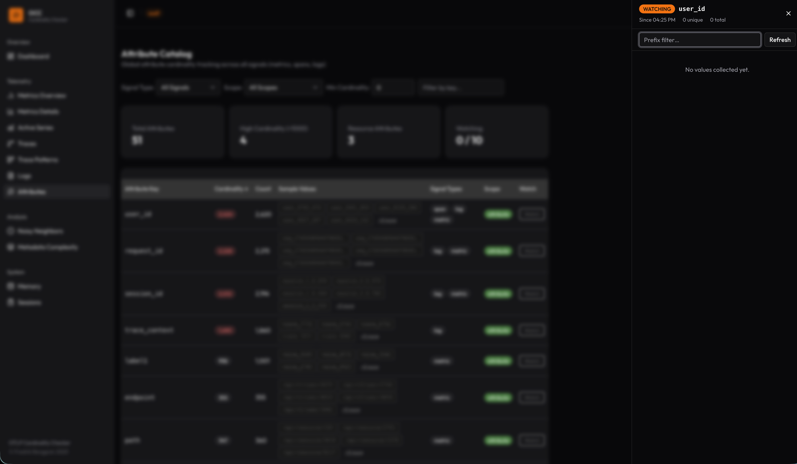

Captures every distinct value seen for a watched attribute key. Activate from the Attributes view or via the API (`POST /api/v1/attributes/{key}/watch`).

## Load Testing

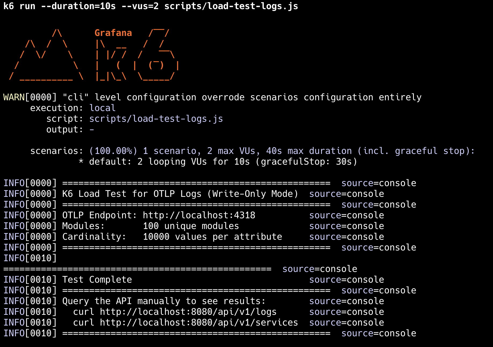

Cardinality behavior under load testing with k6.

## Binary

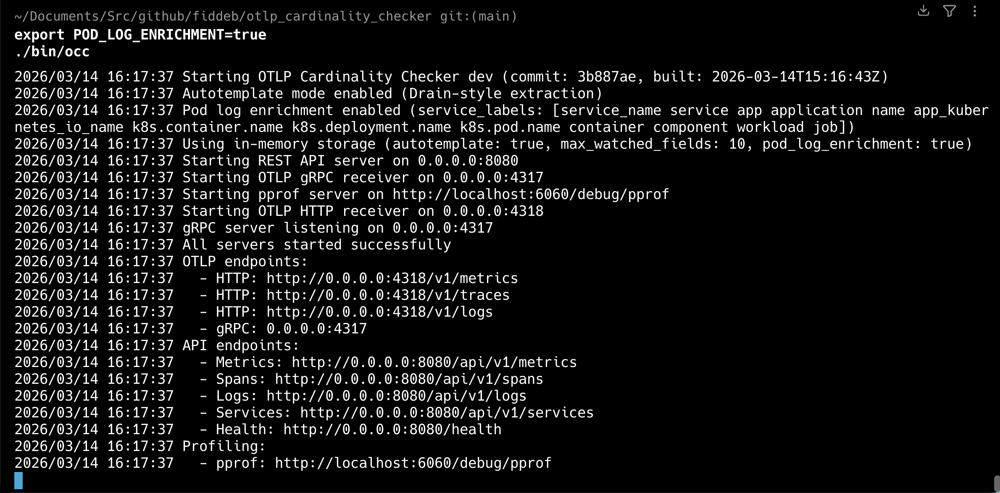

When starting the binary, API addresses, feature flags, and version info are shown.