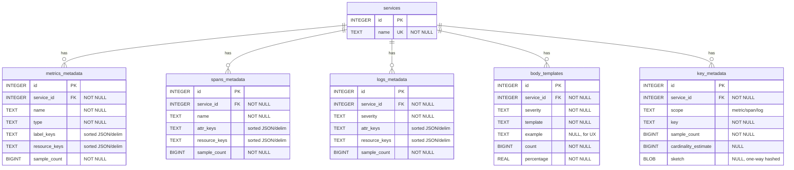

# 2025 Database Backend Research

This document summarizes an unbiased look at storage options to replace the current in‑memory store, and proposes a pragmatic, phased path forward.

## Recommendation (TL;DR)

- Phase A (now): SQLite in WAL mode as primary store, with a single batch-writer goroutine and prepared UPSERTs. Zero‑ops, fast enough, perfect for our single-process server.
- Phase B (later): PostgreSQL (schema-compatible) if we need multi-writer/server deployment or richer time-window analytics (optionally TimescaleDB).
- Phase C (optional analytics): Mirror aggregated facts to ClickHouse if we need heavy dashboards on large history.

## Requirements (from today’s code)

- Signals: metrics, spans, logs.
- We store metadata keys and counts only — never raw values (avoid cardinality explosion).
- Logs: per-service & per-severity body templates with Count and Percentage, plus a single Example body for UX only (not indexed/searchable).
- Metrics/Spans: name, type (metrics), sorted label/resource keys, sample counts; per-service lists.
- Key metadata: sample counts per key; optional estimated cardinality if we add sketches (must remain non-reversible, no raw values).
- Query shapes:
  - List/filter/sort by service/severity/name.
  - Top‑K templates per severity; percent-of-total.
  - Service overview across signals.
- Concurrency model:
  - Single process receiver; readers (HTTP) concurrent with frequent small upserts.
  - We can serialize writes via a dedicated writer goroutine and batch in transactions.
- Throughput:
  - Analyzer exceeds 20–30k EPS; DB ingests aggregated metadata updates (tiny rows) rather than raw logs.
- Retention:
  - Timestamps were removed for memory efficiency; DB can omit FirstSeen/LastSeen initially; add later if needed.
- Operational constraints:
  - Prefer zero‑ops to start; minimal dependencies; easy local dev.

## Candidates (2025) and trade‑offs

- SQLite (WAL)
  - Pros: embedded, zero‑ops, readers don’t block writer and vice versa (one writer total), sequential WAL writes, fast upserts with batching.
  - Cons: single-writer by design; need sensible checkpointing to avoid large WAL under long-lived readers.
  - Docs: Write‑Ahead Logging, checkpoints, and performance considerations (sqlite.org/wal.html; fasterthanfs.html).

- PostgreSQL (+ TimescaleDB)
  - Pros: robust UPSERT (ON CONFLICT), indexing, JSONB, materialized views; TimescaleDB adds hypertables & continuous aggregates when we add time-window analytics.
  - Cons: ops overhead vs SQLite.

- ClickHouse (OLAP mirror)
  - Pros: extremely fast columnar analytics over huge datasets.
  - Cons: less ideal as a primary transactional store for small upserts; higher ops complexity.

- DuckDB
  - Pros: embedded OLAP; great for local analytics.
  - Cons: not a multi-client transactional server; better as analytics engine than online store.

- Embedded KV (Pebble / Badger)
  - Pros: very high write throughput, pure Go, no external service.
  - Cons: you build indexing/query features yourself; our UI benefits from SQL (filter/sort/top‑K).

- libSQL/Turso, LiteFS
  - Pros: edge/replicated SQLite patterns; LiteFS provides SQLite replication with a primary and read replicas.
  - Cons: additional moving parts/platform coupling we don’t need yet.

## Proposed phased path

1) Phase A — SQLite/WAL as primary
- Single process, single host: ideal fit; minimal ops.
- Batch-upsert writer goroutine; prepared statements inside BEGIN…COMMIT.
- Keep parity with in-memory API; feature flag to switch store.

2) Phase B — PostgreSQL (when/if needed)
- Same schema layout for a clean migration.
- Add TimescaleDB if time-window aggregates become central to the product.

3) Phase C — Analytics mirror (optional)
- Dual-write aggregated facts to ClickHouse for dashboards; keep SQLite/Postgres authoritative.

## Initial schema (SQLite/Postgres compatible)

### Entity-Relationship Diagram



**Key relationships:**
- All tables reference `services` with CASCADE delete.
- `body_templates` is per (service, severity, template) — tracks Drain-extracted log patterns.
- `key_metadata` tracks individual label/attribute keys across signals (scope).

### DDL

```sql
-- services
CREATE TABLE services (
  id INTEGER PRIMARY KEY,
  name TEXT NOT NULL UNIQUE
);

-- metrics metadata
CREATE TABLE metrics_metadata (
  id INTEGER PRIMARY KEY,
  service_id INTEGER NOT NULL REFERENCES services(id) ON DELETE CASCADE,
  name TEXT NOT NULL,
  type TEXT NOT NULL,
  label_keys TEXT NOT NULL,      -- sorted JSON array or delimiter-joined string (SQLite)
  resource_keys TEXT NOT NULL,   -- same encoding as above
  sample_count BIGINT NOT NULL,
  UNIQUE(service_id, name)
);
CREATE INDEX idx_metrics_service_name ON metrics_metadata(service_id, name);

-- spans metadata
CREATE TABLE spans_metadata (
  id INTEGER PRIMARY KEY,
  service_id INTEGER NOT NULL REFERENCES services(id) ON DELETE CASCADE,
  name TEXT NOT NULL,
  attr_keys TEXT NOT NULL,
  resource_keys TEXT NOT NULL,
  sample_count BIGINT NOT NULL,
  UNIQUE(service_id, name)
);
CREATE INDEX idx_spans_service_name ON spans_metadata(service_id, name);

-- logs metadata (aggregated per severity)
CREATE TABLE logs_metadata (
  id INTEGER PRIMARY KEY,
  service_id INTEGER NOT NULL REFERENCES services(id) ON DELETE CASCADE,
  severity TEXT NOT NULL,
  attr_keys TEXT NOT NULL,
  resource_keys TEXT NOT NULL,
  sample_count BIGINT NOT NULL,
  UNIQUE(service_id, severity)
);
CREATE INDEX idx_logs_service_severity ON logs_metadata(service_id, severity);

-- body templates per (service, severity)
CREATE TABLE body_templates (
  id INTEGER PRIMARY KEY,
  service_id INTEGER NOT NULL REFERENCES services(id) ON DELETE CASCADE,
  severity TEXT NOT NULL,
  template TEXT NOT NULL,
  example TEXT NULL,
  count BIGINT NOT NULL,
  percentage REAL NOT NULL,
  UNIQUE(service_id, severity, template)
);
CREATE INDEX idx_templates_topk ON body_templates(service_id, severity, count DESC);

-- key metadata (optional sketches later)
CREATE TABLE key_metadata (
  id INTEGER PRIMARY KEY,
  service_id INTEGER NOT NULL REFERENCES services(id) ON DELETE CASCADE,
  scope TEXT NOT NULL CHECK(scope IN ('metric','span','log')),
  key TEXT NOT NULL,
  sample_count BIGINT NOT NULL,
  cardinality_estimate BIGINT NULL,
  sketch BLOB NULL,
  UNIQUE(service_id, scope, key)
);
CREATE INDEX idx_keymeta_service_scope ON key_metadata(service_id, scope);
```

Encoding notes
- For SQLite, store key arrays as sorted JSON text or a compact delimiter string; in Postgres prefer JSONB if you need indexing later.
- All keys are sorted before serialization for deterministic comparisons.

## SQLite write path tuning

- Single writer goroutine batches upserts (N items or every M ms) inside one transaction.
- Prepared UPSERTs with `ON CONFLICT (...) DO UPDATE` for counters and percentages (e.g., `count = count + EXCLUDED.count`).
- Keep/rotate example body intentionally (e.g., only set when NULL to retain the first, or rotate on schedule).
- PRAGMAs (tune to environment):
  - `PRAGMA journal_mode=WAL;`
  - `PRAGMA synchronous=NORMAL;` (use FULL for maximum durability)
  - `PRAGMA wal_autocheckpoint = <pages>;` (or drive checkpoints in a background loop)
  - Optional: cache_size (negative for MB), mmap_size, temp_store=MEMORY.
- Readers: WAL allows readers concurrent with the writer; avoid very long-lived read transactions to prevent checkpoint starvation.

## Mapping to current API

- Introduce a DB-backed Store behind the existing storage interface; keep function shapes the same as the in-memory implementation.
- Examples:
  - `ListLogs(service, severity)` → SELECT templates ORDER BY count DESC (percentages either stored or computed).
  - `ServiceOverview()` → small aggregate SELECTs by signal.
  - `ListMetrics/Spans/Logs` → SELECT with filters/sorts and paging.
- Feature flag: `USE_DB=sqlite|postgres|memory` to select implementation.
- Migrations: use a standard tool (e.g., golang-migrate) for DDL.

## Next steps

1) Implement the SQLite store prototype:
   - Batch writer goroutine + prepared UPSERTs
   - Minimal reader queries wired to existing HTTP handlers
   - Feature flag to switch stores
2) Micro-bench at target rates with concurrent readers; validate p95 latencies & WAL checkpoint behavior.
3) If/when needed, make the schema Postgres-ready and add a second implementation using the same interface.

## Sources
- SQLite Write-Ahead Logging (concurrency, checkpoints): https://www.sqlite.org/wal.html
- SQLite performance vs filesystem: https://www.sqlite.org/fasterthanfs.html
- PostgreSQL INSERT ON CONFLICT (UPSERT): https://www.postgresql.org/docs/current/sql-insert.html
- TimescaleDB overview: https://docs.timescale.com/
- ClickHouse intro: https://clickhouse.com/docs/en/intro
- DuckDB FAQ (concurrency; use-cases): https://duckdb.org/faq.html
- Pebble (Go KV): https://github.com/cockroachdb/pebble
- Badger (Go KV): https://github.com/dgraph-io/badger
- Turso/libSQL overview: https://docs.turso.tech/
- LiteFS (SQLite replication): https://fly.io/docs/litefs/
